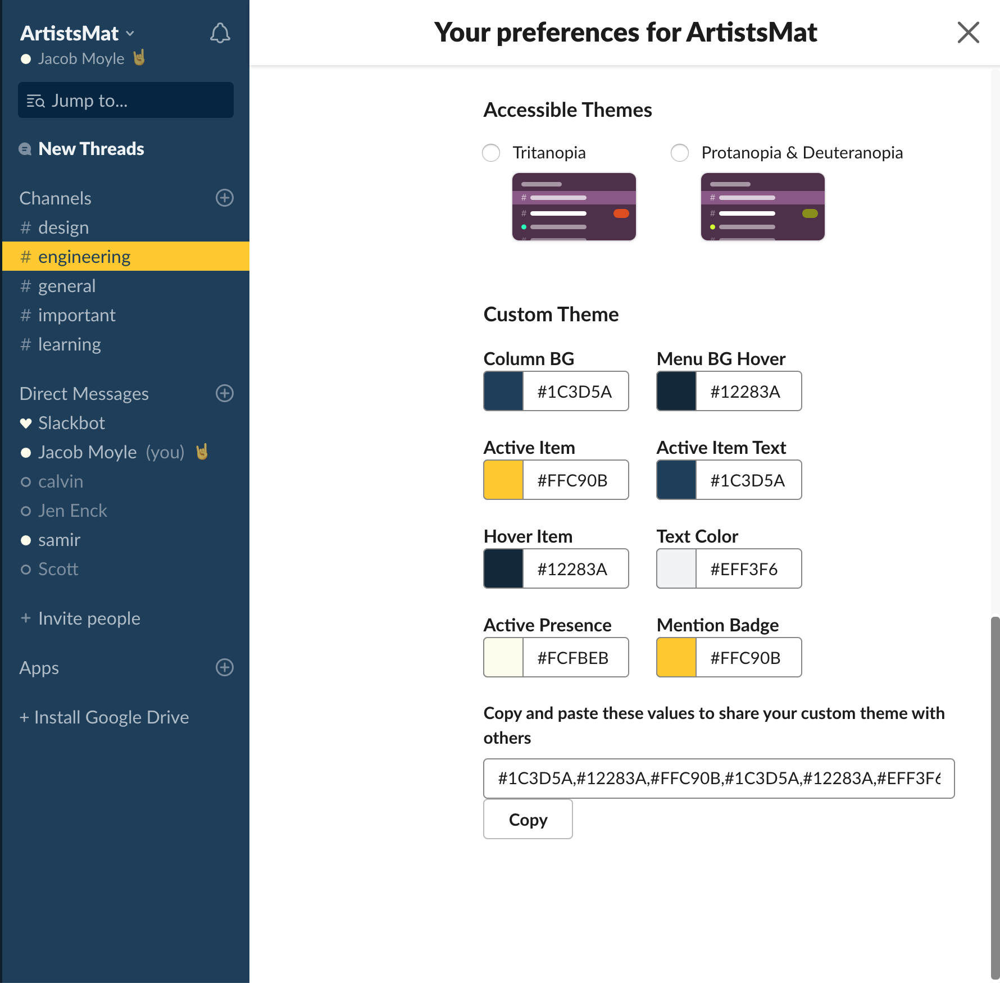

# :nail_care: Themes

Slack themes for companies I've worked for. These are all based off some type of branding that caught my eye and do not accurately represent the actual company branding guidelines. I also prefer dark themes :full_moon_with_face:

## [ClearMetal](https://www.clearmetal.com/)

Less intense active bubbles:

```css
#2d3e55,#7b7d83,#ea5329,#eff3f6,#7b7d83,#eff3f6,#43badf,#43badf
```

    

## [The Artists Mat](https://www.instagram.com/artistsmat/?hl=en)

```css
#1c3d5a,#12283a,#ffc90b,#1c3d5a,#12283a,#eff3f6,#fcfbeb,#ffc90b
```

    



# Todo:

I've made themes for the following companies but have since lost them. Will remake some day.

## [RestlessBandit]()

## [Novillus]()

## [8th Light]()

## [DevBootcamp]()
